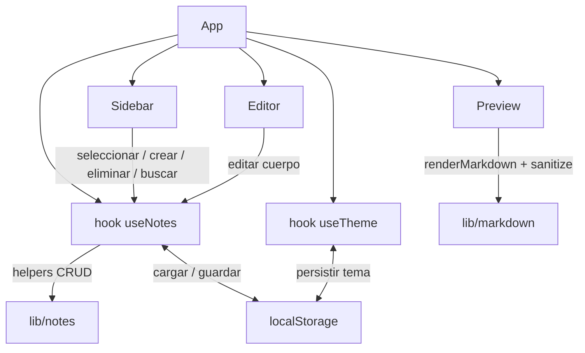

<!-- ══════════════════════════ PORTADA ══════════════════════════ -->
<div align="center">
  
</div>

<!-- ══════════════════════ IDIOMAS / LANGUAGES ══════════════════════ -->
<div align="center">
<a href="README.md"></a>
<a href="README.en.md"></a>
<a href="README.es.md"></a>
</div>

<div align="center">
  
</div>

<h1 align="center">marknote</h1>
<p align="center"><em>App de notas Markdown rápida, con preview en vivo lado a lado</em></p>
<p align="center"><strong>Escribe → preview renderizado en tiempo real → todo guardado automáticamente en el navegador</strong></p>

<div align="center">
<a href="https://github.com/geoggrigori/marknote/actions/workflows/ci.yml"></a>


</div>

<div align="center">
<a href="#acerca-de"></a>
<a href="#funcionalidades"></a>
<a href="#arquitectura"></a>
<a href="#uso"></a>
</div>

<br/>

> 💾 **Sin cuenta, sin backend.** Todo se guarda en el `localStorage` de tu navegador — nada se envía a ningún lado.

<div align="center">
  
</div>

## Acerca de

**marknote** es una app de notas Markdown limpia y rápida, con preview en vivo lado a lado. Escribe a la izquierda, ve el HTML renderizado a la derecha, con todo guardado automáticamente en el navegador.

## Funcionalidades

- 📝 **Preview en vivo** — Markdown renderizado mientras escribes.
- 🗂️ **Gestión de notas** — crear, seleccionar, editar y eliminar desde la barra lateral.
- 🔍 **Búsqueda full-text** — filtra notas por título o contenido al instante.
- 🔢 **Conteo de palabras/caracteres** en vivo.
- ⬇️ **Exportar como `.md`** con un clic.
- 🌓 **Tema claro/oscuro** — tu elección se recuerda.
- 🛡️ **Renderizado seguro** — Markdown parseado con [`marked`](https://marked.js.org) y sanitizado con [`DOMPurify`](https://github.com/cure53/DOMPurify) contra XSS.

## Arquitectura



Los componentes de UI son presentacionales. Toda la lógica CRUD de notas vive en helpers puros y testeables en `src/lib/notes.ts`, orquestados por el hook `useNotes`, que también maneja la persistencia vía `src/lib/storage.ts`.

## Uso

```bash
git clone https://github.com/geoggrigori/marknote.git
cd marknote
npm install
npm run dev
```

Abre la URL impresa (usualmente `http://localhost:5173`). En la primera ejecución, se crean algunas notas de ejemplo automáticamente.

```bash
npm run build     # type-check + build optimizado en dist/
npm run test      # pruebas (Vitest + Testing Library)
```

## Licencia

[MIT](LICENSE).

<div align="center">
  
</div>

<p align="center"><sub>Desarrollado por <strong><a href="https://github.com/geoggrigori">Grigori</a></strong> · 2026</sub></p>
