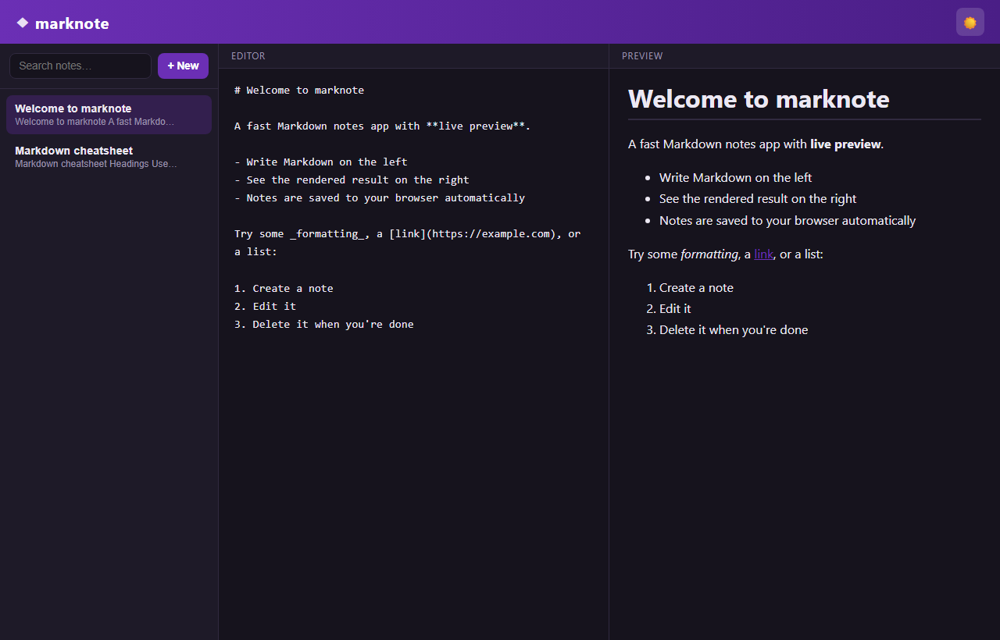
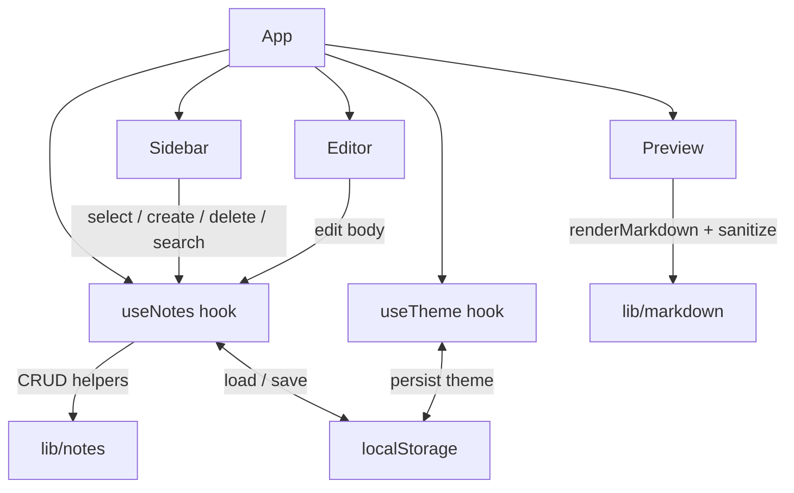

[](https://github.com/geoggrigori/marknote/actions/workflows/ci.yml)



[](https://react.dev)
[](https://www.typescriptlang.org)
[](https://vite.dev)
[](https://vitest.dev)
[](#license)

# marknote

**marknote** is a clean, fast Markdown notes app with a live side-by-side
preview. Write on the left, see rendered HTML on the right, and have everything
saved automatically in your browser. No accounts, no backend — just your notes.

## Features

- 📝 **Live preview** — Markdown is rendered as you type, side by side with the editor.
- 🗂️ **Note management** — create, select, edit, and delete notes from the sidebar.
- 🔍 **Full-text search** — instantly filter notes by title or body content.
- 🔢 **Live word & character count** — the editor shows up-to-date stats for the current note as you type.
- ⬇️ **Export as `.md`** — download the current note as a Markdown file with one click.
- 🌓 **Light / dark theme** — toggle themes; your choice is remembered.
- 💾 **Local persistence** — notes are stored in `localStorage`, so they survive reloads.
- 🛡️ **Safe rendering** — Markdown is parsed with [`marked`](https://marked.js.org)
  and sanitized with [`DOMPurify`](https://github.com/cure53/DOMPurify) to prevent XSS.
- ⚡ **Tiny & fast** — built with React, TypeScript, and Vite.

## Architecture



The UI components are presentational. All note CRUD logic lives in pure,
testable helpers in `src/lib/notes.ts`, orchestrated by the `useNotes` hook,
which also handles persistence through `src/lib/storage.ts`. Markdown rendering
and sanitization are isolated in `src/lib/markdown.ts`.

## Installation

```bash
git clone https://github.com/geoggrigori/marknote.git
cd marknote
npm install
```

## Usage

Start the development server:

```bash
npm run dev
```

Then open the printed URL (usually <http://localhost:5173>). On first launch a
couple of sample notes are seeded so you have something to explore.

## Build

```bash
npm run build    # type-check and produce an optimized build in dist/
npm run preview  # preview the production build locally
```

## How persistence works

Notes are kept in React state and mirrored to the browser's `localStorage`
under the key `marknote.notes.v1` whenever they change. On load, marknote reads
that key; if it is empty (a first visit), it seeds a small set of welcome notes.
The selected theme is stored separately under `marknote.theme`. Because storage
is per-browser, your notes stay on your machine — nothing is sent anywhere.

## Running tests

Tests use [Vitest](https://vitest.dev) with
[Testing Library](https://testing-library.com) and jsdom. They cover the note
CRUD helpers, search filtering, the `useNotes` hook, and Markdown rendering /
sanitization (including a malicious-input case).

```bash
npm run test -- --run   # run once
npm run test            # watch mode
```

## License

Released under the [MIT License](LICENSE). © 2026 Geovana Grigorio.
