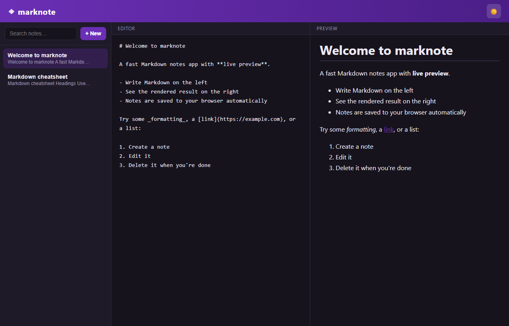
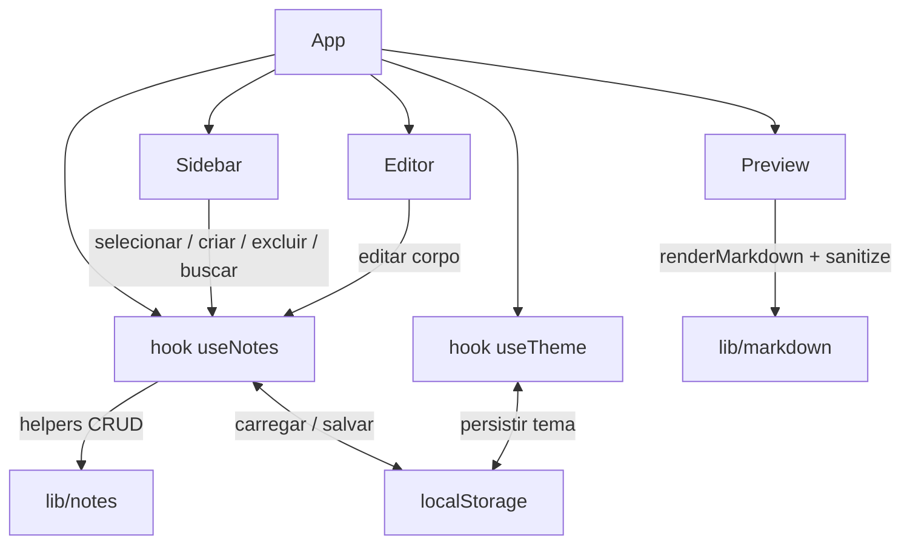

<!-- ══════════════════════════ TÍTULO ══════════════════════════ -->
<div align="center">
  
</div>

<br/>

<!-- ══════════════════════ IDIOMAS / LANGUAGES ══════════════════════ -->
<div align="center">
<a href="README.md"></a>
<a href="README.en.md"></a>
<a href="README.es.md"></a>
</div>

<br/>

<h1 align="center">marknote</h1>
<p align="center"><em>App de notas Markdown rápido, com preview ao vivo lado a lado</em></p>
<p align="center"><strong>Escreva → preview renderizado em tempo real → tudo salvo automaticamente no navegador</strong></p>

<div align="center">
<a href="https://github.com/geoggrigori/marknote/actions/workflows/ci.yml"></a>


</div>

<div align="center">
<a href="#sobre"></a>
<a href="#funcionalidades"></a>
<a href="#arquitetura"></a>
<a href="#uso"></a>
</div>

<br/>

> 💾 **Sem conta, sem backend.** Tudo fica salvo no `localStorage` do seu navegador — nada é enviado a lugar nenhum.

<div align="center">
  
</div>

## Sobre

**marknote** é um app de notas Markdown limpo e rápido, com preview lado a lado ao vivo. Escreva à esquerda, veja o HTML renderizado à direita, com tudo salvo automaticamente no navegador.

## Funcionalidades

- 📝 **Preview ao vivo** — Markdown renderizado enquanto você digita.
- 🗂️ **Gestão de notas** — criar, selecionar, editar e excluir pela sidebar.
- 🔍 **Busca full-text** — filtra notas por título ou conteúdo instantaneamente.
- 🔢 **Contagem de palavras/caracteres** ao vivo.
- ⬇️ **Exportar como `.md`** com um clique.
- 🌓 **Tema claro/escuro** — sua escolha é lembrada.
- 🛡️ **Renderização segura** — Markdown parseado com [`marked`](https://marked.js.org) e sanitizado com [`DOMPurify`](https://github.com/cure53/DOMPurify) contra XSS.

## Arquitetura


```mermaid
flowchart TD
    App[App]
    App --> Sidebar[Sidebar]
    App --> Editor[Editor]
    App --> Preview[Preview]
    App --> useNotes[hook useNotes]
    App --> useTheme[hook useTheme]
    Sidebar -->|selecionar / criar / excluir / buscar| useNotes
    Editor -->|editar corpo| useNotes
    Preview -->|renderMarkdown + sanitize| Markdown[lib/markdown]
    useNotes -->|helpers CRUD| Notes[lib/notes]
    useNotes <-->|carregar / salvar| Storage[localStorage]
    useTheme <-->|persistir tema| Storage
```

Os componentes de UI são apresentacionais. Toda a lógica CRUD de notas vive em helpers puros e testáveis em `src/lib/notes.ts`, orquestrados pelo hook `useNotes`, que também cuida da persistência via `src/lib/storage.ts`.

## Uso

```bash
git clone https://github.com/geoggrigori/marknote.git
cd marknote
npm install
npm run dev
```

Abra a URL impressa (geralmente `http://localhost:5173`). Na primeira execução, algumas notas de exemplo são criadas automaticamente.

```bash
npm run build     # type-check + build otimizado em dist/
npm run test      # testes (Vitest + Testing Library)
```

## Licença

[MIT](LICENSE).

<div align="center">
  
</div>

<p align="center"><sub>Desenvolvido por <strong><a href="https://github.com/geoggrigori">Grigori</a></strong> · 2026</sub></p>
